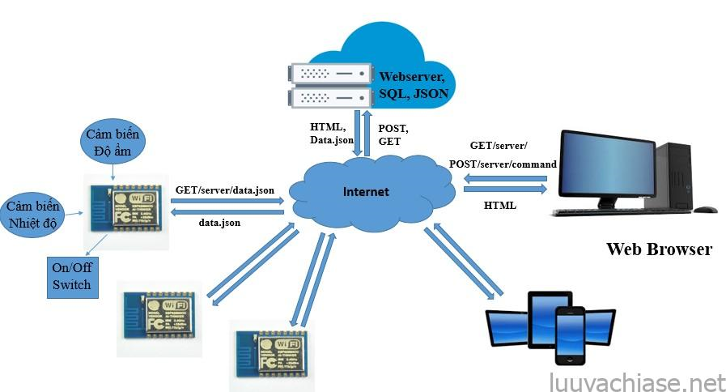
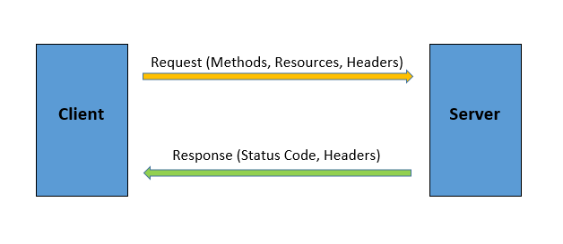
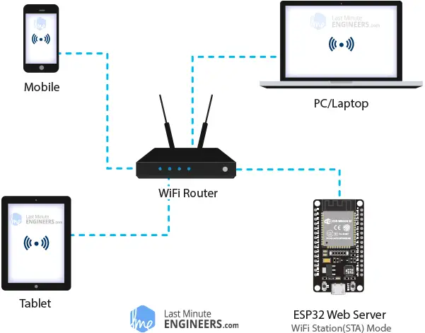
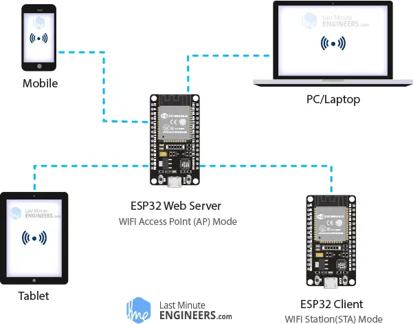
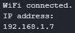
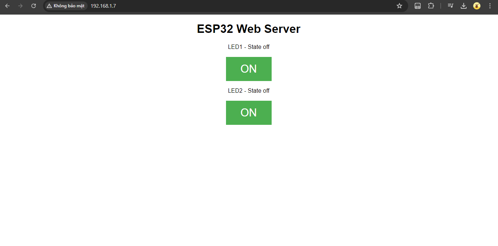
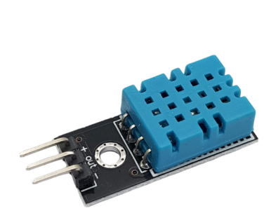
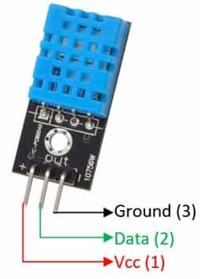

# ELE-D22-NguyenBaHieu - BÁO CÁO CÔNG VIỆC ESP32 NGÀY 30/06/2024
# Nội quy lớp học:
- Trong buổi làm việc theo các câu hỏi được giao
- Nếu trong buổi k thể hoàn thành do nghi sớm, quá khó ... có thể nộp báo cáo sau muộn nhất là trc 1 ngày trước buối tiếp theo.
- Báo cáo không cần quá dài, không được copy chỉ ghi những cái mình đã tìm hiểu được và link trang mình đang tìm hiếu.
- Nộp muộn báo cáo cüng phải có mail để các a bt được. Mail phải có thời gian rö ràng.
- Quá 3 lần không nộp báo cáo, không xin nộp muộn với các lí do không chính đáng.
## A. Công việc đã làm
- Tìm hiểu về đề tài Số 1 - ESP32 Web Server: **Gửi dữ liệu cảm biến DHT lên Web Sever, và điều khiển Led từ Web**
- Link tài liệu tham khảo:
```https://randomnerdtutorials.com/esp32-web-server-arduino-ide/```
```https://lastminuteengineers.com/creating-esp32-web-server-arduino-ide/```
### 1. Tìm hiểu Wed Server


**Web server(máy chủ web)**: là một phần mềm hoặc một hệ thống máy tính được sử dụng để lưu trữ, xử lý, quản lý và cung cấp các tệp và ứng dụng web cho các máy khách( wed clients) 

**Web client(máy khách web)**: là các trình duyệt web mà chúng ta sử dụng trên máy tính và điện thoại
thông qua giao thức HTTP (Hypertext Transfer Protocol). 

Ví dụ:
- Khi một trình duyệt web như Chrome, Firefox hoặc Safari gửi yêu cầu đến một địa chỉ web, yêu cầu đó sẽ được gửi đến máy chủ web của trang đó. 
- Máy chủ web sẽ xử lý yêu cầu, tìm kiếm các tệp và tài nguyên tương ứng, sau đó gửi lại các dữ liệu đó đến trình duyệt để hiển thị cho người dùng.

**Máy khách wed và máy chủ web giao tiếp với nhau** bằng giao thức đặc biệt được gọi là Giao thức truyền siêu văn bản (HTTP - Hypertext Transfer Protocol). 
Trong giao thức này, máy khách bắt đầu cuộc trò chuyện bằng cách gửi yêu cầu HTTP cho một trang web cụ thể. Sau đó, máy chủ sẽ gửi lại nội dung của trang web đó hoặc thông báo lỗi nếu không tìm thấy (như Lỗi: **404 Error** nổi tiếng).

**Nhiệm vụ chính** của một máy chủ web là xử lý các yêu cầu từ các trình duyệt web hoặc ứng dụng khác và trả về các tài nguyên web tương ứng, chẳng hạn như các trang HTML, hình ảnh, tệp tin CSS, JavaScript, và các tài nguyên đa phương tiện khác.


### 2. Tìm hiểu các chế độ của Web Sever
ESP32 có khả năng không chỉ kết nối với mạng WiFi hiện có và hoạt động như một Web server mà còn tạo ra mạng riêng, cho phép các thiết bị khác kết nối trực tiếp với mạng đó và truy cập các trang web.
Điều này khả thi vì ESP32 có thể hoạt động ở ba chế độ: chế độ **Station (STA)**, chế độ **Soft Access Point (AP)** và cả hai chế độ cùng lúc.
#### a. Station (STA) Mode
Ở chế độ Station, ESP32 kết nối với mạng WiFi hiện có (mạng do bộ định tuyến không dây của bạn tạo ra).



Ở chế độ STA, ESP32 lấy địa chỉ IP từ bộ định tuyến không dây mà nó được kết nối. Với địa chỉ IP này, nó có thể thiết lập máy chủ web và phục vụ các trang web cho tất cả các thiết bị được kết nối trên mạng WiFi hiện có.
#### b. Soft Access Point (AP) Mode
Ở chế độ Soft Access Point, ESP32 thiết lập mạng WiFi riêng và hoạt động như một hub, giống như một bộ định tuyến WiFi. 
Tuy nhiên, không giống như bộ định tuyến WiFi, nó không có giao diện với mạng có dây.
- **Hạn chế:** không quá năm trạm có thể kết nối với nó cùng một lúc.



Ở chế độ AP, ESP32 tạo một mạng WiFi mới và gán cho nó một SSID (tên mạng) và một địa chỉ IP. 
Với địa chỉ IP này, nó có thể phục vụ các trang web cho tất cả các thiết bị được kết nối.
### 3. Điều khiển LED qua Wifi - Station (STA) Mode
**Cơ chế hoạt động:** Chúng ta sẽ kiểm soát mọi thứ bằng cách truy cập vào một URL cụ thể.
Khi ta nhập URL vào trình duyệt web, nó sẽ gửi yêu cầu HTTP (còn gọi là yêu cầu GET) đến máy chủ web. 
Máy chủ web có trách nhiệm xử lý yêu cầu này.

Giả sử bạn nhập một URL như http://192.168.1.7/ vào trình duyệt. 
Sau đó, trình duyệt sẽ gửi yêu cầu HTTP đến ESP32. 
Khi ESP32 nhận được yêu cầu này, nó nhận ra rằng người dùng muốn bật đèn LED. 
Kết quả là, nó bật đèn LED và gửi một trang web động đến trình duyệt hiển thị trạng thái của đèn LED là "bật". 

**Code:**
```
#include <WiFi.h>
// Replace with your network credentials
const char* ssid = ".?"; 
const char* password = "12345678"; 

// Set web server port number to 80
WiFiServer server(80);

// Variable to store the HTTP request
String header;

// Auxiliar variables to store the current output state
String led1State = "off";
String led2State = "off";

// Assign output variables to GPIO pins
const int led1 = 13;
const int led2 = 12;

void setup() {
  Serial.begin(115200);
  // Initialize the output variables as outputs
  pinMode(led1, OUTPUT);
  pinMode(led2, OUTPUT);
  // Set outputs to LOW
  digitalWrite(led1, LOW);
  digitalWrite(led2, LOW);

  // Connect to Wi-Fi network with SSID and password
  Serial.print("Connecting to ");
  Serial.println(ssid);
  WiFi.begin(ssid, password);
  while (WiFi.status() != WL_CONNECTED) {
    delay(500);
    Serial.print(".");
  }
  // Print local IP address and start web server
  Serial.println("");
  Serial.println("WiFi connected.");
  Serial.println("IP address: ");
  Serial.println(WiFi.localIP());
  server.begin();
}

void loop(){
  WiFiClient client = server.available();   // Listen for incoming clients

  if (client) {                             // If a new client connects,
    Serial.println("New Client.");          // print a message out in the serial port
    String currentLine = "";                // make a String to hold incoming data from the client
    while (client.connected()) {            // loop while the client's connected
      if (client.available()) {             // if there's bytes to read from the client,
        char c = client.read();             // read a byte, then
        Serial.write(c);                    // print it out the serial monitor
        header += c;
        if (c == '\n') {                    // if the byte is a newline character
          // if the current line is blank, you got two newline characters in a row.
          // that's the end of the client HTTP request, so send a response:
          if (currentLine.length() == 0) {
            // HTTP headers always start with a response code (e.g. HTTP/1.1 200 OK)
            // and a content-type so the client knows what's coming, then a blank line:
            client.println("HTTP/1.1 200 OK");
            client.println("Content-type:text/html");
            client.println("Connection: close");
            client.println();
            
            // turns the GPIOs on and off
            if (header.indexOf("GET /26/on") >= 0) {
              Serial.println("LED1 on");
              led1State = "on";
              digitalWrite(led1, HIGH);
            } else if (header.indexOf("GET /26/off") >= 0) {
              Serial.println("LED1 off");
              led1State = "off";
              digitalWrite(led1, LOW);
            } else if (header.indexOf("GET /27/on") >= 0) {
              Serial.println("LED2 on");
              led2State = "on";
              digitalWrite(led2, HIGH);
            } else if (header.indexOf("GET /27/off") >= 0) {
              Serial.println("LED2 off");
              led2State = "off";
              digitalWrite(led2, LOW);
            }
            
            // Display the HTML web page
            client.println("<!DOCTYPE html><html>");
            client.println("<head><meta name=\"viewport\" content=\"width=device-width, initial-scale=1\">");
            client.println("<link rel=\"icon\" href=\"data:,\">");
            // CSS to style the on/off buttons 
            // Feel free to change the background-color and font-size attributes to fit your preferences
            client.println("<style>html { font-family: Helvetica; display: inline-block; margin: 0px auto; text-align: center;}");
            client.println(".button { background-color: #4CAF50; border: none; color: white; padding: 16px 40px;");
            client.println("text-decoration: none; font-size: 30px; margin: 2px; cursor: pointer;}");
            client.println(".button2 {background-color: #555555;}</style></head>");
            
            // Web Page Heading
            client.println("<body><h1>ESP32 Web Server</h1>");
            
            // Display current state, and ON/OFF buttons for LED1  
            client.println("<p>LED1 - State " + led1State + "</p>");
            // If the led1State is off, it displays the ON button       
            if (led1State=="off") {
              client.println("<p><a href=\"/26/on\"><button class=\"button\">ON</button></a></p>");
            } else {
              client.println("<p><a href=\"/26/off\"><button class=\"button button2\">OFF</button></a></p>");
            } 
               
            // Display current state, and ON/OFF buttons for LED2  
            client.println("<p>LED2 - State " + led2State + "</p>");
            // If the led2State is off, it displays the ON button       
            if (led2State=="off") {
              client.println("<p><a href=\"/27/on\"><button class=\"button\">ON</button></a></p>");
            } else {
              client.println("<p><a href=\"/27/off\"><button class=\"button button2\">OFF</button></a></p>");
            }
            client.println("</body></html>");
            
            // The HTTP response ends with another blank line
            client.println();
            // Break out of the while loop
            break;
          } else { // if you got a newline, then clear currentLine
            currentLine = "";
          }
        } else if (c != '\r') {  // if you got anything else but a carriage return character,
          currentLine += c;      // add it to the end of the currentLine
        }
      }
    }
    // Clear the header variable
    header = "";
    // Close the connection
    client.stop();
    Serial.println("Client disconnected.");
    Serial.println("");
  }
}
```
- Chạy chương trình và mở Serial Monitor để lây địa chỉ IP:



- Giao diện điều khiển



**Phân tích thích code:**
- `WiFi.begin()` hàm này để kết nối vào một mạng hiện có.
- `WiFi.status()` chức năng này để kiểm tra trạng thái kết nối.
- `WiFi.localIP()` chức năng này được sử dụng để in địa chỉ IP của ESP32.
### 4. DHT11 - Cảm Biến Độ Ẩm, Nhiệt Độ


**Định dạng sơ đồ chân DHT11 và cấu hình:**



- Vcc - Nguồn điện 3.5V đến 5.5V
- Data - Đầu ra cả Nhiệt độ và Độ ẩm thông qua Dữ liệu nối tiếp
- Ground - Kết nối với mặt đất của mạch

**Đọc dữ liệu từ module DHT11**
```
#include "DHT.h"
#define DHTPIN 15     // what digital pin the DHT sensor is connected to
#define DHTTYPE DHT11   // there are multiple kinds of DHT sensors
DHT dht(DHTPIN, DHTTYPE);
void setup() {
  Serial.begin(115200);
  Serial.println("DHTxx test!");
  dht.begin();
}
void loop() {
  // Wait a few seconds between measurements.
  delay(2000);
  float h = dht.readHumidity();
  // Read temperature as Celsius (the default)
  float t = dht.readTemperature();
  // Read temperature as Fahrenheit (isFahrenheit = true)
  float f = dht.readTemperature(true);
  // Check if any reads failed and exit early (to try again).
  if (isnan(h) || isnan(t) || isnan(f)) {
    Serial.println("Failed to read from DHT sensor!");
    return;
  }
  Serial.print("Humidity: ");
  Serial.print(h);
  Serial.print(" %\t");
  Serial.print("Temperature: ");
  Serial.print(t);
  Serial.print(" *C ");
  Serial.print(f);
  Serial.print(" *F\t");
}
```
## B. Vướng mắc gặp phải
- Chưa gửi được dữ liệu cảm biến DHT lên Web Sever
## C. Công việc tiếp theo
- Tiếp tục tìm hiểu đề tài, hoàn thiện những phần còn thiếu.