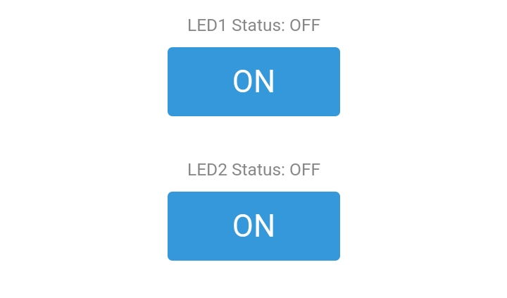
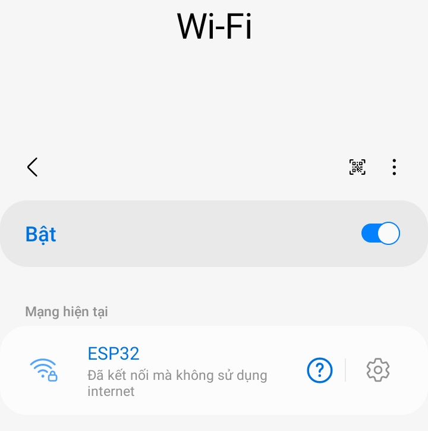
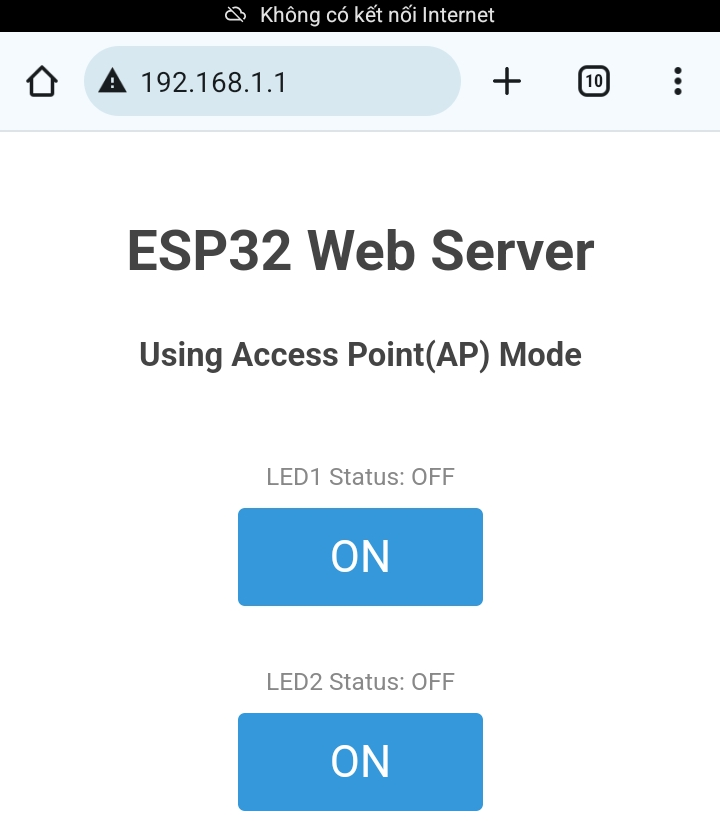
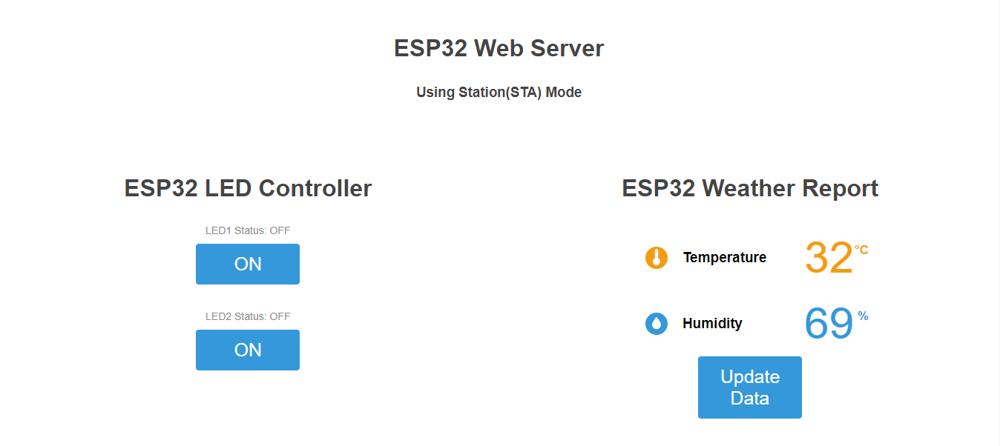

# ELE-D22-NguyenBaHieu - BÁO CÁO CÔNG VIỆC ESP32 NGÀY 07/07/2024
# Nội quy lớp học:
- Trong buổi làm việc theo các câu hỏi được giao
- Nếu trong buổi k thể hoàn thành do nghi sớm, quá khó ... có thể nộp báo cáo sau muộn nhất là trc 1 ngày trước buối tiếp theo.
- Báo cáo không cần quá dài, không được copy chỉ ghi những cái mình đã tìm hiểu được và link trang mình đang tìm hiếu.
- Nộp muộn báo cáo cüng phải có mail để các a bt được. Mail phải có thời gian rö ràng.
- Quá 3 lần không nộp báo cáo, không xin nộp muộn với các lí do không chính đáng.
## A. Công việc đã làm
- Hoàn thiện đề tài Số 1 - ESP32 Web Server: **Gửi dữ liệu cảm biến DHT lên Web Sever, và điều khiển Led từ Web**
- Link báo cáo trước: 
```https://github.com/eleptit-club/ELE-D22-NguyenBaHieu/tree/main/ESP32/240630```
- Link tài liệu tham khảo:
```https://randomnerdtutorials.com/esp32-web-server-arduino-ide/```
### 1. Chỉnh sửa lại code và giao diện của phần điều khiển Led
- **Code:**
```
String SendHTML(uint8_t led1stat,uint8_t led2stat){
  String ptr = "<!DOCTYPE html> <html>\n";
  ptr +="<head><meta name=\"viewport\" content=\"width=device-width, initial-scale=1.0, user-scalable=no\">\n";
  ptr +="<title>LED Control</title>\n";
  ptr +="<style>html { font-family: Helvetica; display: inline-block; margin: 0px auto; text-align: center;}\n";
  ptr +="body{margin-top: 50px;} h1 {color: #444444;margin: 50px auto 30px;} h3 {color: #444444;margin-bottom: 50px;}\n";
  ptr +=".button {display: block;width: 80px;background-color: #3498db;border: none;color: white;padding: 13px 30px;text-decoration: none;font-size: 25px;margin: 0px auto 35px;cursor: pointer;border-radius: 4px;}\n";
  ptr +=".button-on {background-color: #3498db;}\n";
  ptr +=".button-on:active {background-color: #2980b9;}\n";
  ptr +=".button-off {background-color: #34495e;}\n";
  ptr +=".button-off:active {background-color: #2c3e50;}\n";
  ptr +="p {font-size: 14px;color: #888;margin-bottom: 10px;}\n";
  ptr +="</style>\n";
  ptr +="</head>\n";
  ptr +="<body>\n";
  ptr +="<h1>ESP32 Web Server</h1>\n";
    ptr +="<h3>Using Station(STA) Mode</h3>\n";
  
   if(led1stat)
  {ptr +="<p>LED1 Status: ON</p><a class=\"button button-off\" href=\"/led1off\">OFF</a>\n";}
  else
  {ptr +="<p>LED1 Status: OFF</p><a class=\"button button-on\" href=\"/led1on\">ON</a>\n";}

  if(led2stat)
  {ptr +="<p>LED2 Status: ON</p><a class=\"button button-off\" href=\"/led2off\">OFF</a>\n";}
  else
  {ptr +="<p>LED2 Status: OFF</p><a class=\"button button-on\" href=\"/led2on\">ON</a>\n";}

  ptr +="</body>\n";
  ptr +="</html>\n";
  return ptr;
}
```
- **Giao diện điều khiển LED:**


### 2. Thêm cách điều khiển LED - Soft Access Point (AP) Mode
- **Chỉnh sửa phần khai báo mạng:**
```/* Put your SSID & Password */
const char* ssid = "ESP32";  // Enter SSID here
const char* password = "123456789";  //Enter Password here

/* Put IP Address details */
IPAddress local_ip(192,168,1,1);
IPAddress gateway(192,168,1,1);
IPAddress subnet(255,255,255,0);
```
- Thêm trong phần ```void setup()```

```
  WiFi.softAP(ssid, password);
  WiFi.softAPConfig(local_ip, gateway, subnet);
  delay(100);
```
- Sau khi chạy chương trình ESP32 sẽ tạo ra 1 mạng Wifi với thông tin mà ta đã khai báo



- Sau khi kết nối với mạng, ta truy cập vào `local_ip` - `192,168,1,1`


### 3. Thêm phần gửi dữ liệu cảm biến DHT11 lên Web Server
- **Code:** https://github.com/eleptit-club/ELE-D22-NguyenBaHieu/blob/main/ESP32/240707/DHT11_LED_Wifi.ino

- **Sơ đồ chân:**
	+ 3V3 - VCC
	+ GND - GND
	+ D15 - DATA
	+ D4 - LED1
	+ D5 - LED2

- **Video Demo:** https://youtube.com/shorts/BKALsPEjuK0?si=EhTnFf9I9tsxGDCO
### 4. Tạo 1 button "Update" khi nhấn sẽ cập nhật nhiệt độ, độ ẩm
- Thêm trong phần `void setup()` khi có URL `/update` sẽ thực hiện hàm `handle_update()`
```
server.on("/update", handle_update);
```
- Thêm hàm `handle_update()` có chức năng cập nhập nhiệt độ, độ ẩm rồi truyền dữ liệu mới lên web
```
void handle_update() {
  Temperature = dht.readTemperature();
  Humidity = dht.readHumidity();
  Serial.println("Updated temperature and humidity values.");
  server.send(200, "text/html", SendHTML(LED1status, LED2status, Temperature, Humidity));
}
```
- Thêm giao diện cho nút `Update Data` trên web
```
ptr += "<a class=\"button\" href=\"/update\">Update Data</a>\n";
```
- **Giao diện tổng quát:**

- **Video Demo:** https://youtube.com/shorts/tKhqeZTNT28?si=rd8D77asNPjEI3hh
## B. Vướng mắc gặp phải
- Không
## C. Công việc tiếp theo
- Em xin định hướng công việc tiếp theo từ các anh ạ.