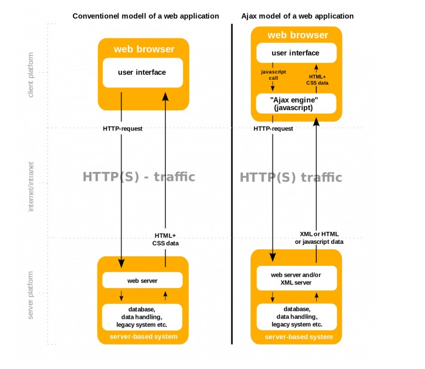
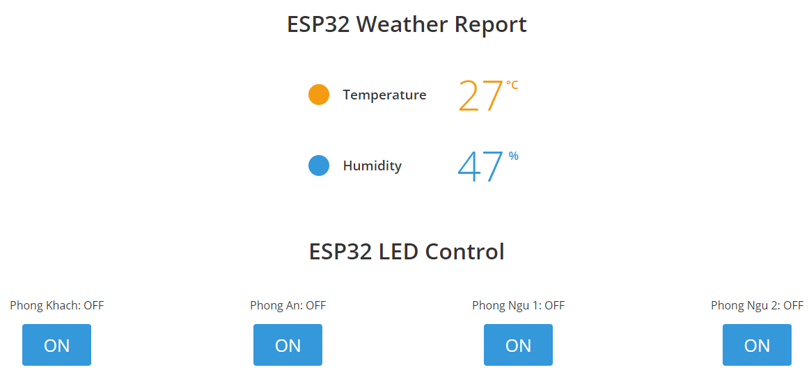

# ELE-D22-NguyenBaHieu - BÁO CÁO CÔNG VIỆC ESP32 NGÀY 14/07/2024
# Nội quy lớp học:
- Trong buổi làm việc theo các câu hỏi được giao
- Nếu trong buổi k thể hoàn thành do nghi sớm, quá khó ... có thể nộp báo cáo sau muộn nhất là trc 1 ngày trước buối tiếp theo.
- Báo cáo không cần quá dài, không được copy chỉ ghi những cái mình đã tìm hiểu được và link trang mình đang tìm hiếu.
- Nộp muộn báo cáo cüng phải có mail để các a bt được. Mail phải có thời gian rö ràng.
- Quá 3 lần không nộp báo cáo, không xin nộp muộn với các lí do không chính đáng.
## A. Công việc đã làm
- Hoàn thiện đề tài Số 1 - ESP32 Web Server: **Gửi dữ liệu cảm biến DHT lên Web Sever, và điều khiển Led từ Web**
- Link báo cáo trước: 
```https://github.com/eleptit-club/ELE-D22-NguyenBaHieu/tree/main/ESP32/240707```
- Link tài liệu tham khảo:
```https://randomnerdtutorials.com/esp32-web-server-arduino-ide/```
### 1. Tìm hiểu về AJAX với WebSever
#### a. AJAX là gì?
**AJAX** là chữ viết tắt của Asynchronous JavaScript and XML. 
Đây là một công nghệ giúp chung ta tạo ra những Web động mà hoàn toàn không reload lại trang. 

- Vậy Asynchronous, JavaScript, XML trong từ AJAX là gì:
    + **Asynchronous** hay nói ngắn hơn là Async – bất đồng bộ. 
    Bất đồng bộ có nghĩa là một chương trình có thể xử lý không theo tuần tự các hàm. 
    Sẽ không có quy trình, có thể nhảy đi bỏ qua bước nào đó. 
    Ích lợi dễ thấy nhất của bất đồng bộ là chương trình có thể xử lý nhiều công việc một lúc.
    + **JavaScript** là một ngôn ngữ lập trình nổi tiếng. 
    Đặc biệt là khả năng quản lý nội dung động của website và hỗ trợ tương tác với người dùng.
    + **XML** là một dạng của ngôn ngữ markup như HTML, chữ đầy đủ của nó là eXtensible Markup Language. 
    Nếu HTML được dùng để hiển thị dữ liệu, XML được thiết kế để chứa dữ liệu.
- Cả JavaScript và XML đều hoạt động bất đồng bộ trong AJAX. 
Kết quả là, nhiều ứng dụng web có thể sử dụng AJAX để gửi và nhận data từ server mà không phải toàn bộ trang.
#### b. AJAX hoạt động như thế nào?
AJAX là một bộ kỹ thuật phát triển web. Bộ hệ thống này bao gồm:
- HTML/XHTML làm ngôn ngữ chính và CSS để tạo phong cách.
- The Document Object Model (DOM) để hiển thị dữ liệu động và tạo tương tác.
- XML để trao đổi dự liệu nội bộ và XSLT để xử lý nó. Nhiều lập trình viên đã thay thế bằng JSON vì nó gần với JavaScript hơn.
- XMLHttpRequest object để giao tiếp bất đồng bộ.

Cuối cùng, JavaScript làm ngôn ngữ lập trình để kết nối toàn bộ các công nghệ trên lại.

**Sơ đồ hoạt động:**



**Bảng so sánh:**
|Mô hình thông thường|Mô hình AJAX|
|---|---|
|1. HTTP được gửi từ trình duyệt lên máy chủ.|1. HTTP được gửi từ trình duyệt lên máy chủ.|
|2. Máy chủ nhận, sau đó phản truy xuất thông tin.|2. Ở dưới nền, trình duyệt tạo một yêu cầu HTTP gửi lên server.|
|3. Server gửi dữ liệu được yêu cầu lại cho trình duyệt.|3. Server tiếp nhận, truy xuất và gửi lại dữ liệu cho trình duyệt.|
|4. Trình duyệt nhận dữ liệu và tải lại trang để hiển thị dữ liệu lên.|4. Trình duyệt nhận dữ liệu từ server và ngay lập tức hiển thị lên trang.|
|Người dùng phải đợi kết thúc quá trình, điều này gây tốn thời gian và làm tăng tải lượng lên server.|Không cần tải lại toàn bộ trang.|
### 2. AJAX với WebSever tự động cập nhật dữ liệu DHT11
Đoạn mã JavaScript trong mã HTML có nhiệm vụ làm cho trang web tự động cập nhật dữ liệu từ máy chủ mỗi 5 giây một lần. 
```c
ptr += "    <script>\n";
ptr += "        setInterval(function() {\n";
ptr += "            fetch('/').then(response => response.text()).then(data => {\n";
ptr += "                document.body.innerHTML = data;\n";
ptr += "            });\n";
ptr += "        }, 5000); // Cập nhật mỗi 0.5 giây\n";
ptr += "    </script>\n";
```

- `setInterval()`: là một hàm JavaScript cho phép thực thi một đoạn mã lặp đi lặp lại sau một khoảng thời gian nhất định.
- `fetch('/').then(response => response.text()).then(data => { ... });`: Đoạn mã này sử dụng fetch() để gửi yêu cầu GET đến địa chỉ / trên máy chủ ESP32 (đây là địa chỉ được khai báo trong các hàm server.on("/") và server.handleClient()). 
Sau đó, nó nhận phản hồi từ máy chủ và thực hiện các xử lý dữ liệu.
	+ `fetch('/').then(response => response.text())`: Gửi yêu cầu GET đến địa chỉ / và nhận phản hồi dưới dạng văn bản.
	+ `.then(data => { ... });`: Khi nhận được dữ liệu từ máy chủ, thực hiện hàm xử lý dữ liệu.
- `document.body.innerHTML = data;`: Sau khi nhận được dữ liệu mới từ máy chủ, nội dung của thẻ <body> trong HTML của trang web sẽ được cập nhật bằng dữ liệu mới này. 
Điều này làm cho trang web có thể hiển thị dữ liệu cập nhật mà không cần tải lại toàn bộ trang.
### 3. Tạo giao diện Web gồm 4 căn phòng, bật 4 led tượng trưng cho 4 phòng
- Khai báo thêm 2 LED mới
```
uint8_t LED3pin = 18;
bool LED3status = LOW;

uint8_t LED4pin = 19;
bool LED4status = LOW;
```
- Thêm trong phần `void setup()`
```
    pinMode(LED3pin, OUTPUT);
    pinMode(LED4pin, OUTPUT);
	
	server.on("/led3", handleLED3);
    server.on("/led4", handleLED4);
```
- Chỉnh sửa phần điều khiển LED1 và tương tự với các LED còn lại
```
void handleLED1() {
    LED1status = !LED1status;
    server.send(200, "text/html", SendHTML(Temperature, Humidity, LED1status, LED2status, LED3status, LED4status));
}
```
- **Giao diện tổng quát:**

- **Video Demo:** https://youtu.be/Cx4v5KoSJpo
## B. Vướng mắc gặp phải
- Không
## C. Công việc tiếp theo
- Thêm LCD, API thời tiết, button ở phần cứng để bật/tắt LED và cập nhật lên Web.