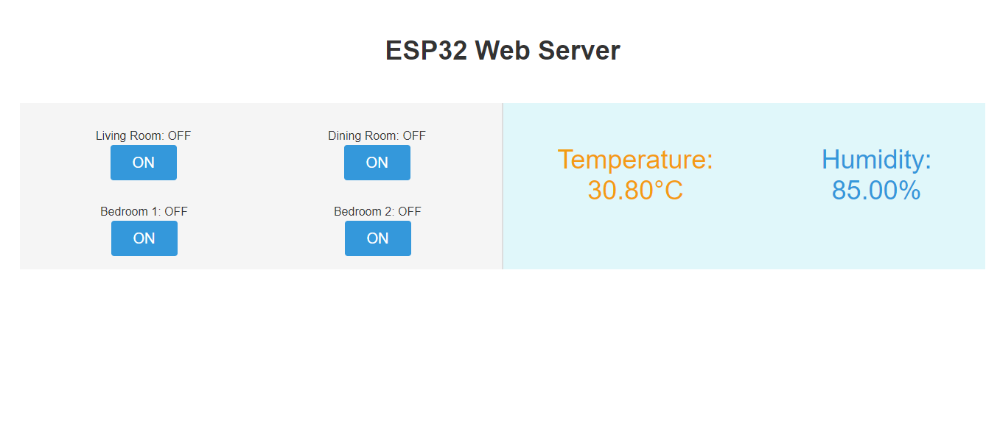

# ELE-D22-NguyenBaHieu - BÁO CÁO CÔNG VIỆC ESP32 NGÀY 30/07/2024
# Nội quy lớp học:
- Trong buổi làm việc theo các câu hỏi được giao
- Nếu trong buổi k thể hoàn thành do nghi sớm, quá khó ... có thể nộp báo cáo sau muộn nhất là trc 1 ngày trước buối tiếp theo.
- Báo cáo không cần quá dài, không được copy chỉ ghi những cái mình đã tìm hiểu được và link trang mình đang tìm hiếu.
- Nộp muộn báo cáo cüng phải có mail để các a bt được. Mail phải có thời gian rö ràng.
- Quá 3 lần không nộp báo cáo, không xin nộp muộn với các lí do không chính đáng.
## A. Công việc đã làm
- Hoàn thiện đề tài Số 1 - ESP32 Web Server: **Gửi dữ liệu cảm biến DHT lên Web Sever, và điều khiển Led từ Web**
- Link báo cáo trước: 
```https://github.com/eleptit-club/ELE-D22-NguyenBaHieu/tree/main/ESP32/240714```
- Link tài liệu tham khảo:
```https://randomnerdtutorials.com/esp32-web-server-arduino-ide/```
### 1. Thay đổi phần khai báo bằng mảng
- Thay đổi để thu gọn phần khai báo, dễ dàng quản lí
```c
const int NUM_BUTTONS = 4;
const int BUTTON_PINS[NUM_BUTTONS] = {4, 5, 18, 19};
const int LED_PINS[NUM_BUTTONS] = {12, 13, 14, 27};

bool LEDStatus[NUM_BUTTONS] = {LOW, LOW, LOW, LOW};
boolean button_states[NUM_BUTTONS] = {HIGH, HIGH, HIGH, HIGH};
unsigned long lastDebounceTimes[NUM_BUTTONS] = {0, 0, 0, 0};
const unsigned long debounceDelay = 50;

#define DHTPIN 15
#define DHTTYPE DHT11
DHT dht(DHTPIN, DHTTYPE);

float temperature;
float humidity;

void setup() {
  Serial.begin(115200);
  delay(100);

  for (int i = 0; i < NUM_BUTTONS; i++) {
    pinMode(BUTTON_PINS[i], INPUT_PULLUP);
    pinMode(LED_PINS[i], OUTPUT);
    digitalWrite(LED_PINS[i], LOW);
  }
  dht.begin();
}
```
- Từ việc khai báo như trên, ta có thể chỉ cần dùng 1 hàm để thay đổi trạng thái cho tất cả LED từ Web
```c
void handleLED(int index) {
  LEDStatus[index] = !LEDStatus[index];  // Chuyển đổi trạng thái của LED chỉ định
  digitalWrite(LED_PINS[index], LEDStatus[index] ? HIGH : LOW); // Cập nhật trạng thái LED
  server.send(200, "text/html", SendHTML());
}
```
### 2. Thêm phần button để điều khiển LED ở phần cứng
- Phần chống nhiễu cho button theo `example` debounceDelay 
	+ Có thêm phần hiện thông báo khi nhấn button
	
```c
void handleButton(int index) {
  int buttonPin = BUTTON_PINS[index];
  int ledPin = LED_PINS[index];

  boolean currentButtonState = digitalRead(buttonPin);

  unsigned long currentTime = millis();

  if ((currentTime - lastDebounceTimes[index]) > debounceDelay) {
    if (currentButtonState == LOW) {
      if (button_states[index] == HIGH) {
        LEDStatus[index] = !LEDStatus[index];
        digitalWrite(ledPin, LEDStatus[index] ? HIGH : LOW);

        Serial.print("Button at pin ");
        Serial.print(buttonPin);
        Serial.println(" pressed");

        button_states[index] = LOW;
        handleStatus();
      }
    } else {
      button_states[index] = HIGH;
    }
    lastDebounceTimes[index] = currentTime;
  }
}
```
- Xác định các chân kết nối:
	+ buttonPin và ledPin là các chân (pins) kết nối của nút nhấn và đèn LED tương ứng với chỉ số index đã định dạng sẵn trong phần khai báo. 
	+ Các giá trị này được lấy từ các mảng BUTTON_PINS và LED_PINS.
- Đọc trạng thái hiện tại của nút nhấn:
	+ `currentButtonState` lưu trữ trạng thái hiện tại của nút nhấn, được đọc từ chân `buttonPin`.
	+ Hàm `digitalRead(buttonPin)` trả về `HIGH` nếu nút không được nhấn và `LOW` nếu nút bị nhấn.
- Xử lý độ trễ chống rung:
	+ Đoạn mã sẽ kiểm tra thời gian hiện tại `currentTime` và so sánh với thời gian mà nút đã được đọc lần cuối `(lastDebounceTimes[index])`. 
	+ Nếu thời gian chênh lệch lớn hơn độ trễ chống rung `debounceDelay`, đoạn mã tiếp tục xử lý nút nhấn.
- Kiểm tra và cập nhật trạng thái nút nhấn:
	+ Nếu nút nhấn hiện tại là `LOW` (được nhấn), hàm kiểm tra trạng thái nút nhấn trước đó `(button_states[index])`:
		+ Nếu trạng thái trước đó là `HIGH` (không nhấn), nghĩa là nút vừa mới được nhấn. Khi đó, trạng thái của đèn LED `(LEDStatus[index])` sẽ bị đảo ngược (chuyển từ bật thành tắt hoặc ngược lại).
		+ Trạng thái nút nhấn (button_states[index]) được đặt thành LOW và hàm handleStatus() được gọi để xử lý các công việc liên quan.
	+ Nếu nút nhấn hiện tại không được nhấn `HIGH`, trạng thái nút nhấn `(button_states[index])` được đặt thành HIGH.
- Cập nhật thời gian đọc nút:
	+ lastDebounceTimes[index] được cập nhật với thời gian hiện tại (currentTime) để chuẩn bị cho lần đọc nút tiếp theo.
### 3. Cải thiện phần web
- Cập nhật trạng thái LED và dữ liệu DHT mỗi 1 giây
```
  html += "<script>\n";
  html += "function updateStatus() {\n";
  html += "  fetch('/status')\n";
  html += "    .then(response => response.text())\n";
  html += "    .then(html => {\n";
  html += "      document.getElementById('status').innerHTML = html;\n";
  html += "    });\n";
  html += "}\n";
  html += "window.onload = updateStatus;
  html += "setInterval(updateStatus, 1000);
  html += "</script>\n";
```
- **Giao diện tổng quát:**

- **Video Demo:** https://youtu.be/xXKMr5YzogE
## B. Vướng mắc gặp phải
- Không
## C. Công việc tiếp theo