# A. Báo cáo tổng quan những project đã làm
# 1. Các ngôn lập trình đã học 
- C/C++
- Python(đang học) 
# 2. Các vi điều khiển đã sử dụng:
- Arduino
- ESP32 
- STM32(đang học): làm quen STM32 với led, Led 7 đoạn, button

## Project

### ESP32 Web Server: 
- Gửi dữ liệu cảm biến DHT lên Web Sever, điều khiển Led từ Web và button 
- Giao diện điều khiển:

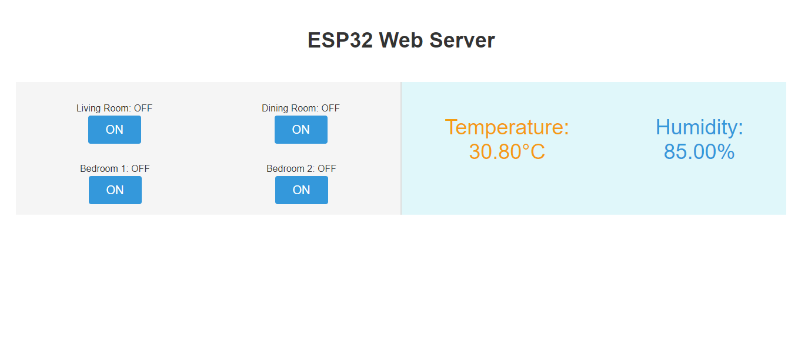
- Code: https://github.com/hieunguyen253/Bao_Cao_Tong_Quan_Project/tree/main/Code/ESP32_Web_Server
- Video Demo: https://youtu.be/xXKMr5YzogE
- Tham khảo: https://randomnerdtutorials.com/esp32-web-server-arduino-ide/
### Raspberry Pi 4 Web Server( có làm quen với máy tính nhúng ): 
- Thực hiện kết nối cảm biến nhiệt độ, độ ẩm DHT1 với Raspberry PI. Lập chương trình thực hiện chức năng sau:
	+ Cải đặt máy chủ web flask, cài đặt hệ quản trị cơ sở dữ liệu Mariadb.
	+ Đọc dữ liệu từ cảm biển DHT11 đưa vào cơ sở dữ liệu Mariadb.
	+ Xây dựng web hiển thị nhiệt độ, độ ẩm dạng Chart
- Giao diện điều khiển:

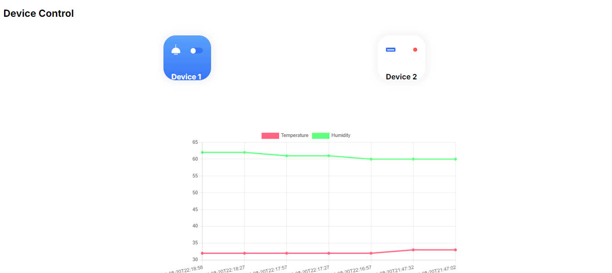
- Video Demo: https://youtube.com/shorts/jiwZ2iEqW4E
- Code: https://github.com/hieunguyen253/Bao_Cao_Tong_Quan_Project/tree/main/Code/RaspberryPi4_Web_Server/SourceCode
- Tham khảo: https://github.com/Vothongminh/CODE-025/blob/main/index.html

**Các web đã được tùy chỉnh giao diện từ giao diện mẫu [ em có nắm căn bản (chưa thực hành nhiều) về HTML, CSS và Javascript]**
# 3. Altium cơ bản:

## Mạch buck / boost dùng TL494
- **SCH:**

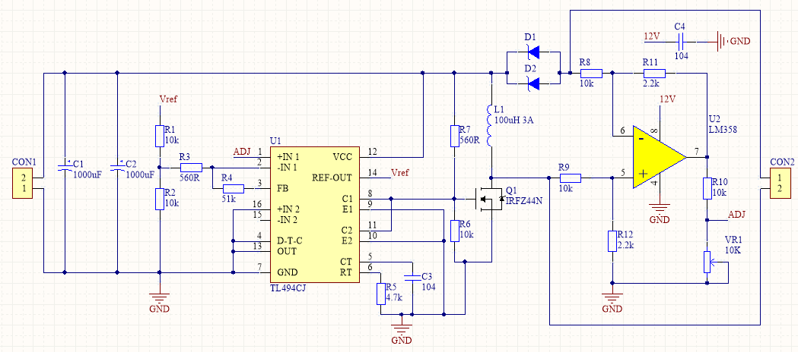

- **PCB:**

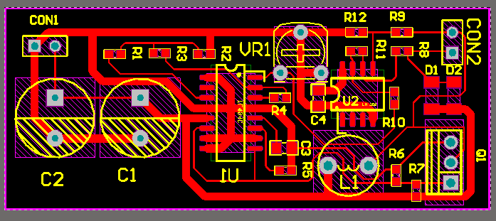

- **3D:**

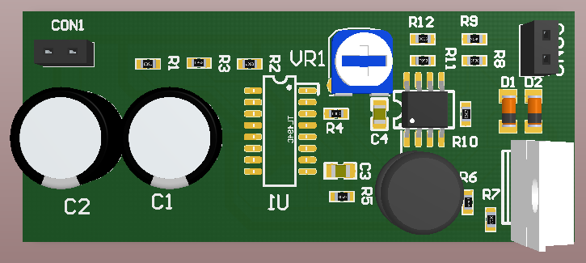

## Mạch Giảm Áp 3.3V AMS1117
+ **SCH:**

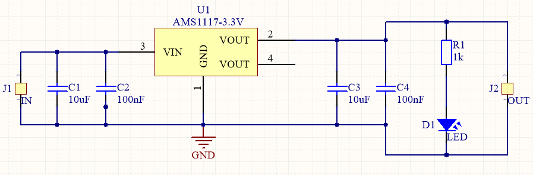

+ **PCB:**

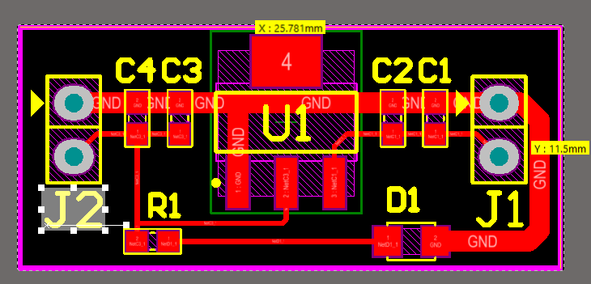

+ **3D:**

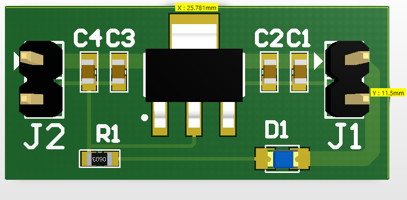

## High-Current Half-Bridge using FAN73912: điều khiển điện áp cao và tốc độ cao cho MOSFET và IGBT
- **SCH:**

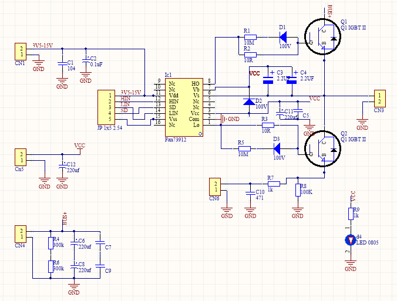

- **PCB:**

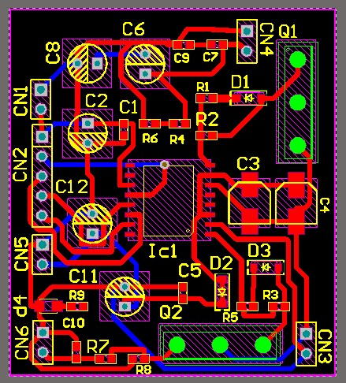

- **3D:**

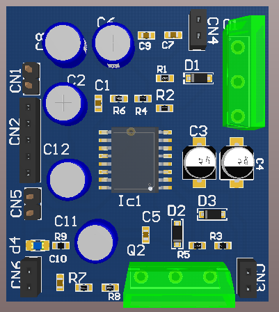

## Mạch USB Charger
+ **SCH:**

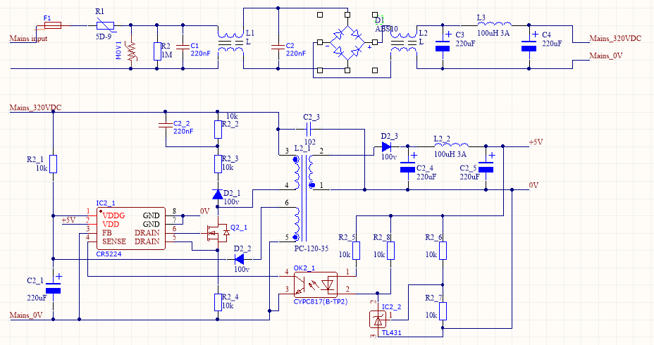

+ **PCB:**

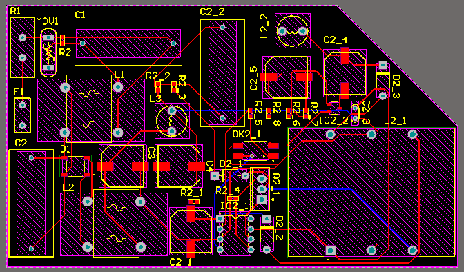

+ **3D:**

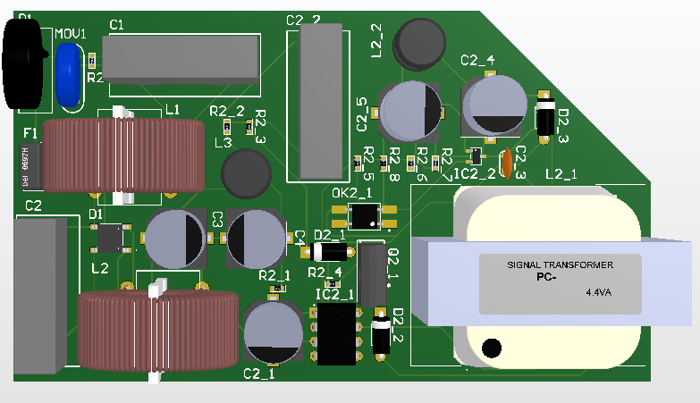
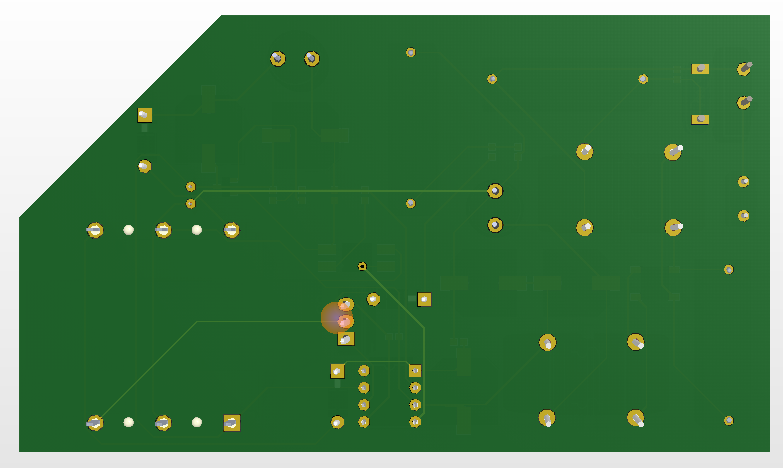

## Mạch chuyển giao tiếp UART TTL to RS485
- **SCH:**

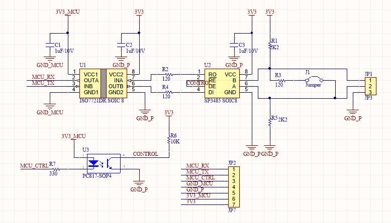

- **PCB:**

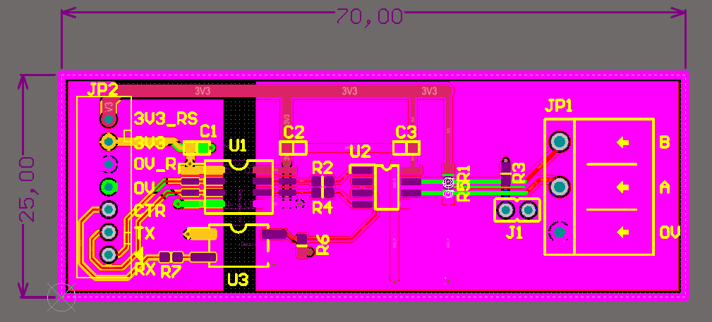

- **3D:**

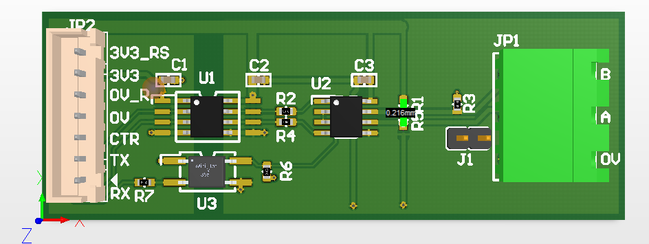
# B. Công việc tiếp theo:
- Em xin Thầy định hướng project cần nghiên cứu

